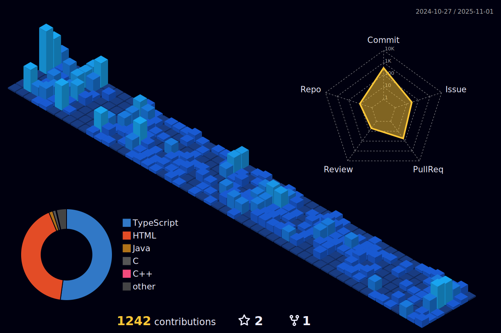

  

  

### 
I'm Ryota, a junior full-stack developer 👨‍💻 studying at Simon Fraser University since 2024 🚀
  
  

- 🔭 I’m currently studying at Simon Fraser University in Computer Science major focusing on Software Systems  
  

- 🌱 I’m interested in Cloud/Infrastructure and Web Development  
  

   

## Connect with me  

  

  

  

## Github Stats  

   

## Activity 
  

   

   

  
  

   

 

----

